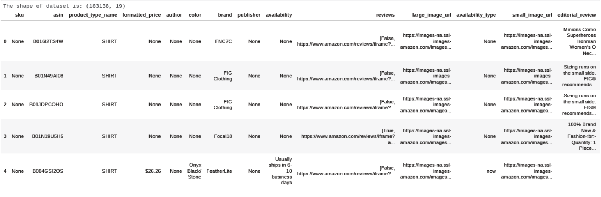

# Group
Victor Marisa R207764L HAI
Anesu Rirwa R204432D HAI
Tariro Gwandiwa R206546B HAI
Perfect-Princess Makuwerere R204448U HAI

## Amazon Fashion Recommendation System

Online shopping can save time for both the buyer and retailer by reducing phone calls about availability, specifications, hours of operation or other information that can be easily found on company and product pages. There are a lot of reasons why customers today prefer shopping online:

1) Convenience.
2) Price comparisons.
3) You can send gifts more easily.
4) No need to travel.

---

The model developed in this project is based on 'Item-Item' similarity. Here, the products are recommended
based on the item that the user is currently seeing and doesn't take into account what his/her previous shopping habits have been. Unsupervised learning algorithm (Nearest Neighbours).

## Data Overview

The dataset contains : 183138 rows, 19 features.

Here, we only consider the features which help us in giving sensible recommendations.

1) _product_type_ 
2) _formatted_price_
3) _color_
4) _brand_ 
5) _title_
6) _image_url_
